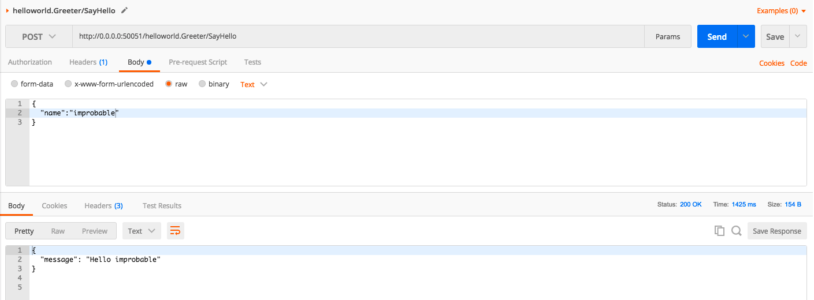
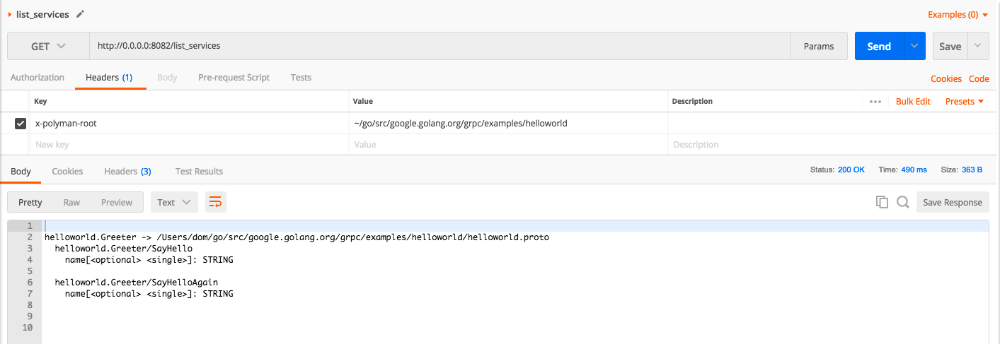

# Polyman

Polyman is a simple HTTP to gRPC proxy.

Polyman is designed to work with [Postman](https://www.getpostman.com/) and bring gRPC to their rich enironment via [Polyglot](https://github.com/grpc-ecosystem/polyglot).



### Installation

Download source:
```
git clone git@github.com:domgreen/polyman.git
```

Build source (with vgo):
```
make
```

Build source (with dep):
```
make depbuild
```

### Adding Polyman Proxy to Postman

* Settings > Proxy
* Enable "Global Proxy Configuration"
* Add localhost:8000

## Starting Polyman

```
polyman [--polyglot] [--port]
```

## Making A Request


Making a request via Polyman is done via a HTTP **POST** and using a json representation of the proto message that will be sent to the server.

#### Request:

```
POST http://0.0.0.0:50051/helloworld.Greeter/SayHello
```

The URL of the request is made up of the host and port where the gRPC service is running, followed by the **Service** name and **method** you are calling.

**Headers**:
```
x-polyman-root: ~/go/src/google.golang.org/grpc/examples/helloworld
```
`x-polyman-root` is the most commonly set Header, this sets the `--proto_discovery_root` in Polyglot that is used to discover protos and generate messages to send via gRPC.


**Body**:
```
{
  "name":"world"
}
```

#### Response:
```
{
  "message": "Hello world"
}

```

## Listing Services



Listing Services gives you detailed information about the Services, Methods and their message structure via a HTTP **GET** request.

#### Request:

```
GET http://0.0.0.0:50051/list_services
```
The request is made to `/list_services` and uses the headers to decide where to look for the proto information.

**Headers**:
```
x-polyman-root: ~/go/src/google.golang.org/grpc/examples/helloworld
```

#### Response:
```
helloworld.Greeter -> ~/go/src/google.golang.org/grpc/examples/helloworld/helloworld.proto
  helloworld.Greeter/SayHello
    name[<optional> <single>]: STRING

  helloworld.Greeter/SayHelloAgain
    name[<optional> <single>]: STRING
```

This response shows a single service `helloworld.Greeter` with two methods `SayHello` and `SayHelloAgain`. It also shows the message definition for making the call.
 
## Options

#### Polyman Config:
```
x-polyman-config: ~/mydir/myconfig.pb.json
```

`x-polyman-config` header tells the proxy the location for the [Polyglot configuration](https://github.com/grpc-ecosystem/polyglot#configuration-optional).
If this is supplied you *may* not need to supply the `x-polyman-root` header, depending on the configuration file that you are using. 

#### Polyman Endpoint:
```
x-polyman-endpoint: 0.0.0.0:50051
```
`x-polyman-endpoint` can be supplied if you are not using the Postman proxy settings; the URL would then be the location of the Polyman proxy, which would use this header to correctly forward the call.
